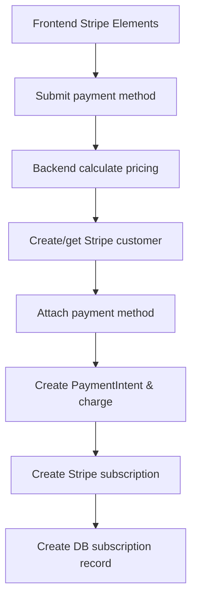
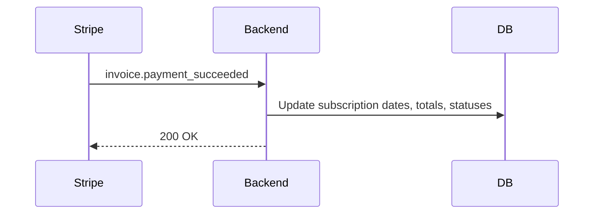

# Subscription System Guide

This document explains the complete subscription system in the backend (`resume_builder_back/`): data models, pricing and proration rules, APIs, Stripe integration, automatic renewals, webhooks, and test scenarios.

## Overview

- The platform sells access per country for a duration defined by a subscription plan.
- The total price is `price_per_country * country_count`.
- Candidates purchase via Stripe using the frontend Stripe Elements UI to submit payment method details.
- On initial purchase:
  - We charge immediately for the current period (prorated if overlapping an existing active subscription window).
  - We create a Stripe subscription for auto-renewal on the next cycle (starting from the current `end_date`).
- Adding/removing countries mid-cycle adjusts the per-cycle price for the next renewal; adding countries also takes a prorated one-time payment for the remainder of the current cycle.
- Stripe webhooks advance the subscription cycle, update totals/statuses, and keep the local database in sync.

## Terminology

- Plan: A product definition containing `duration_days` and `price_per_country`.
- Subscription: Candidate’s active purchase of a plan for selected countries.
- Per-cycle price: `price_per_country * country_count` (full-duration price for the next cycle).
- Proration: Reducing the price proportionally to how many days remain in the current cycle.

## Architecture

- Key services and controllers:
  - `src/services/subscription.service.js`
  - `src/services/stripe.service.js`
  - `src/controllers/subscription.controller.js`
  - `src/routes/subscription.route.js`
- Webhook routes are wired in `src/routes/index.js`.

## Environment

Set the following environment variables (e.g., in `.env`):

**Backend (.env):**

```
STRIPE_SECRET_KEY=sk_test_your_secret_key_here
STRIPE_PUBLISHABLE_KEY=pk_test_your_publishable_key_here
STRIPE_WEBHOOK_SECRET=whsec_your_webhook_secret_here
```

**Frontend (.env):**

```
VITE_STRIPE_PUBLISHABLE_KEY=pk_test_your_publishable_key_here
```

- Without these, payment functionality is unavailable. The server will log warnings.
- Webhooks require your server to be reachable by Stripe. For local development, use a tunneling tool (ngrok, Cloudflared, etc.) and set the webhook endpoint in the Stripe Dashboard.

## Data Models (DB)

- `SubscriptionPlan` (`src/models/subscription_plan.model.js`)

  - `plan_id` (UUID)
  - `name`, `description`
  - `duration_days` (1–365)
  - `price_per_country` (DECIMAL)
  - `is_active` (bool)
  - `stripe_price_id` (string, nullable) — Stripe Price ID created when admin creates plan

- `CandidateSubscription` (`src/models/candidate_subscription.model.js`)

  - `subscription_id` (UUID)
  - `candidate_id` (UUID)
  - `plan_id` (UUID)
  - `stripe_customer_id` (string) — Stripe Customer ID
  - `stripe_subscription_id` (string, nullable) — present when auto-renew is enabled
  - `stripe_payment_intent_id` (string) — last PaymentIntent ID
  - `stripe_price_id` (string) — Stripe Price ID used for this subscription
  - `country_count` (int >= 1)
  - `total_amount` (DECIMAL) — amount for the current cycle
  - `start_date`, `end_date`
  - `status`: `pending | active | expired | cancelled`
  - `payment_status`: `pending | completed | failed | refunded`

- `SubscriptionCountry` (`src/models/subscription_country.model.js`)

  - Links `subscription_id` to `country_id` (unique pair)

- Denormalized `Candidate` columns updated for convenience (not authoritative): `payment_gateway`, `subscription_id`, `qty`, `unit_price`, `expiry_date`.

## Stripe Prices and Billing Frequency

- We map `duration_days` to Stripe recurring intervals:
  - 30 → monthly (1 month), 60 → monthly (2 months), 90 → monthly (3 months), 180 → monthly (6 months), 365 → yearly (1 year)
  - Fallback: round(days/30) months with minimum 1 month
- When an admin creates a plan, we automatically create a Stripe Price via API with:
  - `unit_amount`: `price_per_country * 100` (cents)
  - `recurring.interval` and `recurring.interval_count` based on duration mapping
  - `product_data.name`: plan name
- The Stripe Price ID is stored in `subscription_plans.stripe_price_id` to prevent duplicate price creation.
- If Stripe price creation fails during plan creation, we log a warning and continue. The price will be created during the first subscription checkout as a fallback.

## Pricing and Proration Logic

- Per-cycle price (next renewal):
  - `per_cycle_price = plan.price_per_country * selected_country_count`
- Initial purchase with no active subscription:
  - Charge full `per_cycle_price` and set `start_date = now`, `end_date = now + duration_days`.
- Initial purchase overlapping an active subscription:
  - Determine `remaining_days` in the active subscription.
  - `effective_days = min(remaining_days, duration_days)`
  - `proration_factor = effective_days / duration_days`
  - `prorated_amount = per_cycle_price * proration_factor` (rounded to 2 decimals)
  - Charge `prorated_amount` and set `end_date = now + effective_days`.

## Lifecycle Flows

### 1) Initial Purchase (Candidate)

- Endpoint: `POST /api/candidate/subscriptions`
- Flow (`createCandidateSubscription()`):
  1. Calculate pricing (`calculateSubscriptionPricing()`): validates plan and countries, computes proration if applicable.
  2. Ensure Stripe customer exists (create if needed using candidate email/name).
  3. Attach payment method to customer using `payment_method_nonce` from frontend.
  4. Create and confirm PaymentIntent for the computed amount (immediate charge).
  5. Use existing Stripe Price ID from plan (or create one if missing for old plans).
  6. Create Stripe subscription with:
     - `customer`: Stripe customer ID
     - `items[0].price`: Stripe Price ID
     - `trial_end`: current `end_date` (auto-renews when the current cycle ends)
  7. Create DB `CandidateSubscription` with all Stripe IDs and `status=active`, `payment_status=completed`.



### 2) Auto-Renewal

- Stripe charges automatically at `trial_end` date and onward per plan frequency.
- Webhook `invoice.payment_succeeded` advances the cycle:
  - New `start_date = previous end_date`
  - New `end_date = previous end_date + duration_days`
  - Set `status=active`, `payment_status=completed`, `total_amount = price_per_country * country_count`



### 3) Add Countries Mid-Cycle

- Endpoint: `POST /api/candidate/subscriptions/:subscriptionId/add-countries`
- Flow (`addCountriesToSubscription()`):
  1. Validate ownership, active status, and non-duplicates.
  2. Compute remaining days and prorate for the additional countries.
  3. Charge prorated amount (if > 0) using PaymentIntent.
  4. Update `country_count` and `total_amount`.
  5. Update Stripe subscription price for next cycle (modify subscription items). If no Stripe subscription exists yet, create one starting at current `end_date`.

### 4) Remove Countries Mid-Cycle

- Endpoint: `DELETE /api/candidate/subscriptions/:subscriptionId/countries`
- Flow (`removeCountriesFromSubscription()`):
  1. Validate ownership and active status.
  2. Ensure at least one country remains (cannot remove all).
  3. Update `country_count`.
  4. Update Stripe subscription price for next cycle.

### 5) Cancel Subscription

- Endpoint: `DELETE /api/candidate/subscriptions/:subscriptionId`
- Flow:
  1. Cancel Stripe subscription if present.
  2. Set DB status to `cancelled`. Access continues based on your policy; by default it's immediate cancellation on our side.

## API Endpoints

### Candidate

- `GET /api/candidate/subscription-plans` — List active plans.
- `POST /api/candidate/subscriptions/calculate` — Calculate pricing and dates (proration-aware).
- `GET /api/candidate/subscriptions/client-token` — Get Stripe publishable key (deprecated - now uses frontend env var).
- `POST /api/candidate/subscriptions` — Create subscription (requires `payment_method_nonce`).
- `GET /api/candidate/subscriptions` — Paginated list of candidate’s subscriptions.
- `GET /api/candidate/subscriptions/:subscriptionId` — Retrieve specific subscription.
- `DELETE /api/candidate/subscriptions/:subscriptionId` — Cancel subscription.
- `POST /api/candidate/subscriptions/:subscriptionId/add-countries` — Add countries (prorates).
- `DELETE /api/candidate/subscriptions/:subscriptionId/countries` — Remove countries.

### Admin

- `GET /api/admin/subscriptions` — List all subscriptions.
- `DELETE /api/admin/subscriptions/:subscriptionId` — Cancel any subscription.
- `GET /api/admin/subscription-plans/:planId` — Get plan by ID.
- `GET /api/admin/subscription-plans` — List plans (filters/sort/pagination).
- `POST /api/admin/subscription-plans` — Create plan.
- `PUT /api/admin/subscription-plans/:planId` — Update plan (name/description/duration/price/is_active).
- `DELETE /api/admin/subscription-plans/:planId` — Soft-delete (deactivate) plan.

### Webhooks (No Auth)

- `POST /api/stripe/webhook` — Receives Stripe webhook notifications; we parse and update local status/dates.

## Request/Response Examples (cURL)

- Get client token:

```
curl -H "Authorization: Bearer <token>" \
  http://localhost:3000/api/candidate/subscriptions/client-token
```

- Calculate pricing:

```
curl -X POST -H "Content-Type: application/json" -H "Authorization: Bearer <token>" \
  -d '{"plan_id":"<plan_uuid>","country_ids":["<country_uuid1>","<country_uuid2>"]}' \
  http://localhost:3000/api/candidate/subscriptions/calculate
```

- Create subscription:

```
curl -X POST -H "Content-Type: application/json" -H "Authorization: Bearer <token>" \
  -d '{"plan_id":"<plan_uuid>","country_ids":["<country_uuid1>"],"payment_method_nonce":"<stripe_payment_method_id>"}' \
  http://localhost:3000/api/candidate/subscriptions
```

- Add countries:

```
curl -X POST -H "Content-Type: application/json" -H "Authorization: Bearer <token>" \
  -d '{"country_ids":["<new_country_uuid>"],"payment_method_nonce":"<stripe_payment_method_id>"}' \
  http://localhost:3000/api/candidate/subscriptions/<subscription_id>/add-countries
```

- Remove countries:

```
curl -X DELETE -H "Content-Type: application/json" -H "Authorization: Bearer <token>" \
  -d '{"country_ids":["<country_uuid_to_remove>"]}' \
  http://localhost:3000/api/candidate/subscriptions/<subscription_id>/countries
```

- Cancel subscription:

```
curl -X DELETE -H "Authorization: Bearer <token>" \
  http://localhost:3000/api/candidate/subscriptions/<subscription_id>
```

## Webhook Event Handling

Handled in `src/controllers/subscription.controller.js`:

- `invoice.payment_succeeded`:
  - Update DB to extend `end_date` by `plan.duration_days` from the current end, set `status=active`, `payment_status=completed`, update `total_amount` to full cycle.
- `customer.subscription.deleted`: set `status=cancelled`.
- `invoice.payment_failed`: set `payment_status=failed`.
- `customer.subscription.updated`: handle subscription modifications.

Note: Stripe webhooks provide exact billing period dates for precise `start_date`/`end_date` alignment.

## Frontend Integration Notes

- Set `VITE_STRIPE_PUBLISHABLE_KEY` in frontend environment variables.
- Use Stripe Elements to collect payment method details.
- Create payment method using `stripe.createPaymentMethod()` to get `payment_method_id`.
- Submit `payment_method_id` as `payment_method_nonce` with subscription creation and add-countries calls.
- UI may show: selected countries, per-country price, per-cycle total, proration details, and the next renewal date.

## Testing Scenarios

- No active subscription → create new sub → full charge → Stripe subscription created with trial_end = `end_date`.
- Active subscription remaining 10/30 days → create new sub → prorated immediate charge → set `end_date = now + 10d` → Stripe subscription created for that date.
- Auto-renew webhook success → `end_date` moved forward by `duration_days`; `total_amount` updated.
- Add countries mid-cycle → immediate prorated charge → next cycle price updated in Stripe.
- Remove countries mid-cycle → no immediate charge/refund → next cycle price updated in Stripe; cannot remove all.
- Cancel subscription → cancels Stripe subscription and sets local status to `cancelled`.

## Troubleshooting

- Duplicate Stripe products: Ensure `stripe_price_id` is properly stored when admin creates plans. Run the migration to add the field.
- Webhook not firing: Ensure your public URL is configured in Stripe Dashboard and points to `/api/stripe/webhook` (POST). Verify your tunnel and logs.
- Payment method invalid: Ensure Stripe Elements is properly initialized and payment method is created before submission.
- Proration surprises: Confirm `duration_days` and the currently active subscription's `end_date`—proration is `effective_days / duration_days`.
- Environment variables: Ensure both backend and frontend have correct Stripe keys configured.

## Security

- Webhook POST uses Stripe signature verification in `stripe.service.js`.
- All candidate endpoints require authentication (`checkAuth`).
- No secrets are logged; sensitive operations have warnings and errors only.
- Payment methods are securely handled by Stripe - no card details stored locally.

## Extensibility Ideas

- Add an “Auto-renew” toggle per subscription: if disabled, cancel the Stripe subscription but keep local access until `end_date`.
- Support multi-currency or country-specific pricing.
- Email notifications on renewal success/failure.
- Admin dashboards for renewal health and failed payments.

## File Map (Key)

- `src/services/subscription.service.js` — Business logic: pricing, creation, add/remove countries, cancel.
- `src/services/stripe.service.js` — Stripe integration: customer, PaymentIntent, subscription CRUD, price CRUD, webhook helpers.
- `src/controllers/subscription.controller.js` — API handlers and webhook handling.
- `src/routes/subscription.route.js` — Candidate routes.
- `src/routes/index.js` — Webhook routes.
- Models in `src/models/`: `SubscriptionPlan`, `CandidateSubscription`, `SubscriptionCountry`.
- `src/migrations/20251015120000-add-stripe-price-id-to-subscription-plans.js` — Migration to add Stripe Price ID field.

---

This README documents the complete mechanism and flow for subscriptions, including Stripe auto-renewal and proration. The system has been migrated from Braintree to Stripe for better integration and fewer duplicate products.
