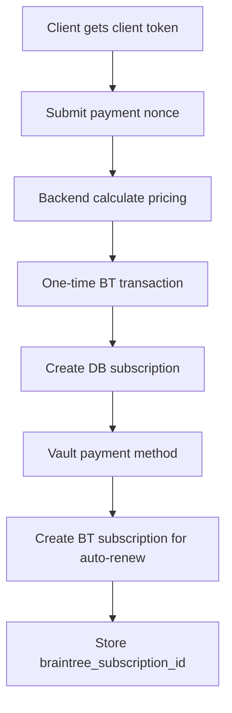
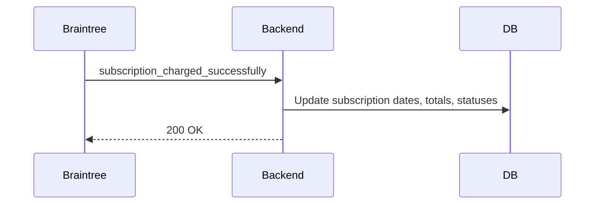

# Subscription System Guide

This document explains the complete subscription system in the backend (`resume_builder_back/`): data models, pricing and proration rules, APIs, Braintree integration, automatic renewals, webhooks, and test scenarios.

## Overview

- The platform sells access per country for a duration defined by a subscription plan.
- The total price is `price_per_country * country_count`.
- Candidates purchase via Braintree using the frontend drop-in UI to submit a payment method nonce.
- On initial purchase:
  - We charge immediately for the current period (prorated if overlapping an existing active subscription window).
  - We vault the payment method and create a Braintree subscription for auto-renewal on the next cycle (starting from the current `end_date`).
- Adding/removing countries mid-cycle adjusts the per-cycle price for the next renewal; adding countries also takes a prorated one-time payment for the remainder of the current cycle.
- Braintree webhooks advance the subscription cycle, update totals/statuses, and keep the local database in sync.

## Terminology

- Plan: A product definition containing `duration_days` and `price_per_country`.
- Subscription: Candidate’s active purchase of a plan for selected countries.
- Per-cycle price: `price_per_country * country_count` (full-duration price for the next cycle).
- Proration: Reducing the price proportionally to how many days remain in the current cycle.

## Architecture

- Key services and controllers:
  - `src/services/subscription.service.js`
  - `src/services/braintree.service.js`
  - `src/controllers/subscription.controller.js`
  - `src/routes/subscription.route.js`
- Webhook routes are wired in `src/routes/index.js`.

## Environment

Set the following environment variables (e.g., in `.env`):

```
BRAINTREE_ENVIRONMENT=Sandbox # or Production
BRAINTREE_MERCHANT_ID=your_merchant_id
BRAINTREE_PUBLIC_KEY=your_public_key
BRAINTREE_PRIVATE_KEY=your_private_key
```

- Without these, payment functionality is unavailable. The server will log warnings.
- Webhooks require your server to be reachable by Braintree. For local development, use a tunneling tool (ngrok, Cloudflared, etc.) and set the webhook endpoint in the Braintree Control Panel.

## Data Models (DB)

- `SubscriptionPlan` (`src/models/subscription_plan.model.js`)

  - `plan_id` (UUID)
  - `name`, `description`
  - `duration_days` (1–365)
  - `price_per_country` (DECIMAL)
  - `is_active` (bool)

- `CandidateSubscription` (`src/models/candidate_subscription.model.js`)

  - `subscription_id` (UUID)
  - `candidate_id` (UUID)
  - `plan_id` (UUID)
  - `braintree_subscription_id` (string, nullable) — present when auto-renew is enabled
  - `braintree_transaction_id` (string, last transaction id)
  - `country_count` (int >= 1)
  - `total_amount` (DECIMAL) — amount for the current cycle
  - `start_date`, `end_date`
  - `status`: `pending | active | expired | cancelled`
  - `payment_status`: `pending | completed | failed | refunded`

- `SubscriptionCountry` (`src/models/subscription_country.model.js`)

  - Links `subscription_id` to `country_id` (unique pair)

- Denormalized `Candidate` columns updated for convenience (not authoritative): `payment_gateway`, `subscription_id`, `qty`, `unit_price`, `expiry_date`.

## Braintree Plans and Billing Frequency

- We map `duration_days` to Braintree `billingFrequency` (months):
  - 30 → 1, 60 → 2, 90 → 3, 180 → 6, 365 → 12 (fallback: round(days/30) and minimum 1)
- When an admin creates a plan, we attempt to create a Braintree plan via API with the same `plan_id` and the appropriate `billingFrequency`.
- If programmatic plan creation is not available in your Braintree account, you must manually create plans in the Control Panel with IDs matching our `plan_id`. We log and continue if plan creation fails, but auto-renew requires the plan to exist in Braintree.

## Pricing and Proration Logic

- Per-cycle price (next renewal):
  - `per_cycle_price = plan.price_per_country * selected_country_count`
- Initial purchase with no active subscription:
  - Charge full `per_cycle_price` and set `start_date = now`, `end_date = now + duration_days`.
- Initial purchase overlapping an active subscription:
  - Determine `remaining_days` in the active subscription.
  - `effective_days = min(remaining_days, duration_days)`
  - `proration_factor = effective_days / duration_days`
  - `prorated_amount = per_cycle_price * proration_factor` (rounded to 2 decimals)
  - Charge `prorated_amount` and set `end_date = now + effective_days`.

## Lifecycle Flows

### 1) Initial Purchase (Candidate)

- Endpoint: `POST /api/candidate/subscriptions`
- Flow (`createCandidateSubscription()`):
  1. Calculate pricing (`calculateSubscriptionPricing()`): validates plan and countries, computes proration if applicable.
  2. Ensure Braintree customer exists (ID = `candidate_id`).
  3. Perform one-time transaction using `payment_method_nonce` for the computed amount.
  4. Create DB `CandidateSubscription` with `status=active`, `payment_status=completed`.
  5. Vault the payment method using the nonce.
  6. Create a Braintree subscription with:
     - `planId = plan_id`
     - `price = per_cycle_price`
     - `firstBillingDate = end_date` (auto-renews when the current cycle ends)
  7. Store `braintree_subscription_id` in DB if creation succeeds.



### 2) Auto-Renewal

- Braintree charges automatically at `firstBillingDate` and onward per plan frequency.
- Webhook `subscription_charged_successfully` advances the cycle:
  - New `start_date = previous end_date`
  - New `end_date = previous end_date + duration_days`
  - Set `status=active`, `payment_status=completed`, `total_amount = price_per_country * country_count`



### 3) Add Countries Mid-Cycle

- Endpoint: `POST /api/candidate/subscriptions/:subscriptionId/add-countries`
- Flow (`addCountriesToSubscription()`):
  1. Validate ownership, active status, and non-duplicates.
  2. Compute remaining days and prorate for the additional countries.
  3. Charge prorated amount (if > 0).
  4. Update `country_count` and `total_amount`.
  5. Update Braintree subscription price for next cycle (`updateSubscription({ price })`). If no BT subscription exists yet, vault + create one starting at current `end_date`.

### 4) Remove Countries Mid-Cycle

- Endpoint: `DELETE /api/candidate/subscriptions/:subscriptionId/countries`
- Flow (`removeCountriesFromSubscription()`):
  1. Validate ownership and active status.
  2. Ensure at least one country remains (cannot remove all).
  3. Update `country_count`.
  4. Update Braintree subscription price for next cycle.

### 5) Cancel Subscription

- Endpoint: `DELETE /api/candidate/subscriptions/:subscriptionId`
- Flow:
  1. Cancel Braintree subscription if present.
  2. Set DB status to `cancelled`. Access continues based on your policy; by default it’s immediate cancellation on our side.

## API Endpoints

### Candidate

- `GET /api/candidate/subscription-plans` — List active plans.
- `POST /api/candidate/subscriptions/calculate` — Calculate pricing and dates (proration-aware).
- `GET /api/candidate/subscriptions/client-token` — Get Braintree client token for drop-in UI.
- `POST /api/candidate/subscriptions` — Create subscription (requires `payment_method_nonce`).
- `GET /api/candidate/subscriptions` — Paginated list of candidate’s subscriptions.
- `GET /api/candidate/subscriptions/:subscriptionId` — Retrieve specific subscription.
- `DELETE /api/candidate/subscriptions/:subscriptionId` — Cancel subscription.
- `POST /api/candidate/subscriptions/:subscriptionId/add-countries` — Add countries (prorates).
- `DELETE /api/candidate/subscriptions/:subscriptionId/countries` — Remove countries.

### Admin

- `GET /api/admin/subscriptions` — List all subscriptions.
- `DELETE /api/admin/subscriptions/:subscriptionId` — Cancel any subscription.
- `GET /api/admin/subscription-plans/:planId` — Get plan by ID.
- `GET /api/admin/subscription-plans` — List plans (filters/sort/pagination).
- `POST /api/admin/subscription-plans` — Create plan.
- `PUT /api/admin/subscription-plans/:planId` — Update plan (name/description/duration/price/is_active).
- `DELETE /api/admin/subscription-plans/:planId` — Soft-delete (deactivate) plan.

### Webhooks (No Auth)

- `GET /api/braintree/webhook` — Verification endpoint for Braintree.
- `POST /api/braintree/webhook` — Receives notifications; we parse and update local status/dates.

## Request/Response Examples (cURL)

- Get client token:

```
curl -H "Authorization: Bearer <token>" \
  http://localhost:3000/api/candidate/subscriptions/client-token
```

- Calculate pricing:

```
curl -X POST -H "Content-Type: application/json" -H "Authorization: Bearer <token>" \
  -d '{"plan_id":"<plan_uuid>","country_ids":["<country_uuid1>","<country_uuid2>"]}' \
  http://localhost:3000/api/candidate/subscriptions/calculate
```

- Create subscription:

```
curl -X POST -H "Content-Type: application/json" -H "Authorization: Bearer <token>" \
  -d '{"plan_id":"<plan_uuid>","country_ids":["<country_uuid1>"],"payment_method_nonce":"<nonce>"}' \
  http://localhost:3000/api/candidate/subscriptions
```

- Add countries:

```
curl -X POST -H "Content-Type: application/json" -H "Authorization: Bearer <token>" \
  -d '{"country_ids":["<new_country_uuid>"],"payment_method_nonce":"<nonce>"}' \
  http://localhost:3000/api/candidate/subscriptions/<subscription_id>/add-countries
```

- Remove countries:

```
curl -X DELETE -H "Content-Type: application/json" -H "Authorization: Bearer <token>" \
  -d '{"country_ids":["<country_uuid_to_remove>"]}' \
  http://localhost:3000/api/candidate/subscriptions/<subscription_id>/countries
```

- Cancel subscription:

```
curl -X DELETE -H "Authorization: Bearer <token>" \
  http://localhost:3000/api/candidate/subscriptions/<subscription_id>
```

## Webhook Event Handling

Handled in `src/controllers/subscription.controller.js`:

- `subscription_charged_successfully`:
  - Update DB to extend `end_date` by `plan.duration_days` from the current end, set `status=active`, `payment_status=completed`, update `total_amount` to full cycle.
- `subscription_canceled`: set `status=cancelled`.
- `subscription_expired`: set `status=expired`.
- `subscription_charged_unsuccessfully`: set `payment_status=failed`.

Note: If available from Braintree, you can switch to using webhook-provided billing period dates for exact `start_date`/`end_date` alignment.

## Frontend Integration Notes

- Get client token via `GET /api/candidate/subscriptions/client-token`.
- Use Braintree Drop-in UI to get `payment_method_nonce`.
- Submit `nonce` with subscription creation and add-countries calls.
- UI may show: selected countries, per-country price, per-cycle total, proration details, and the next renewal date.

## Testing Scenarios

- No active subscription → create new sub → full charge → BT subscription created with firstBillingDate = `end_date`.
- Active subscription remaining 10/30 days → create new sub → prorated immediate charge → set `end_date = now + 10d` → BT subscription created for that date.
- Auto-renew webhook success → `end_date` moved forward by `duration_days`; `total_amount` updated.
- Add countries mid-cycle → immediate prorated charge → next cycle price updated in BT.
- Remove countries mid-cycle → no immediate charge/refund → next cycle price updated in BT; cannot remove all.
- Cancel subscription → cancels BT subscription and sets local status to `cancelled`.

## Troubleshooting

- Plan not found in Braintree: Create the plan in BT Control Panel with `plan_id` matching our UUID. Ensure `billingFrequency` reflects `duration_days` mapping.
- Webhook not firing: Ensure your public URL is configured in Braintree and points to `/api/braintree/webhook` (POST). Verify your tunnel and logs.
- Nonce invalid: Ensure the client token is fresh and the Drop-in UI is initialized correctly for the authenticated candidate.
- Proration surprises: Confirm `duration_days` and the currently active subscription’s `end_date`—proration is `effective_days / duration_days`.

## Security

- Webhook POST uses Braintree signature verification in `braintree.service.js`.
- All candidate endpoints require authentication (`checkAuth`).
- No secrets are logged; sensitive operations have warnings and errors only.

## Extensibility Ideas

- Add an “Auto-renew” toggle per subscription: if disabled, cancel the BT subscription but keep local access until `end_date`.
- Support multi-currency or country-specific pricing.
- Email notifications on renewal success/failure.
- Admin dashboards for renewal health and failed payments.

## File Map (Key)

- `src/services/subscription.service.js` — Business logic: pricing, creation, add/remove countries, cancel.
- `src/services/braintree.service.js` — Braintree integration: token, customer, transaction, subscription CRUD, plan CRUD, webhook helpers.
- `src/controllers/subscription.controller.js` — API handlers and webhook handling.
- `src/routes/subscription.route.js` — Candidate routes.
- `src/routes/index.js` — Webhook routes.
- Models in `src/models/`: `SubscriptionPlan`, `CandidateSubscription`, `SubscriptionCountry`.

---

This README documents the complete mechanism and flow for subscriptions, including Braintree auto-renewal and proration. If you need additional sections or examples (e.g., Postman collection, frontend snippets), let me know and I’ll add them.
